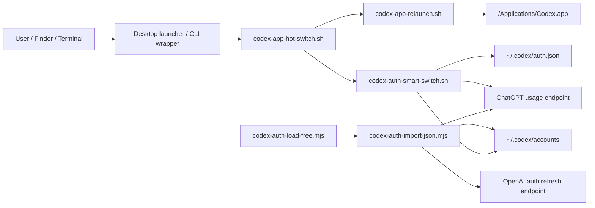

# Architecture / 架构说明

Codex.app Account Switcher 是一个 local-first 的 macOS 工具。项目没有常驻服务、数据库或云端组件，核心职责是在本机账号池中做实时 usage 校验，选择可用账号，写入 Codex.app 使用的 `~/.codex/auth.json`，并按需重启 Codex.app。

## System Context

## Runtime Data Model

Runtime state lives outside the repository by default:

- `~/.codex/auth.json`: Codex.app active auth snapshot. Real switching writes this file atomically through a temp file and verifies it with `cmp`.
- `~/.codex/accounts/registry.json`: account registry, including active account key, account metadata, last usage snapshot, and last-used timestamps.
- `~/.codex/accounts/*.auth.json`: switchable auth snapshots. File names are base64-encoded from `chatgpt_user_id::chatgpt_account_id`.
- `~/.codex/accounts-invalid-sources/`: rejected import source archive.
- `~/.codex/accounts-invalid-archive/`: cleanup archive for removed unusable accounts.

The repository must stay credential-free. Only examples and docs belong here.

## Main Flows

### Account Import

1. `codex-auth-import-json.mjs` parses source JSON from `codex-auth`, `codex-sub2api`, or flat token exports.
2. Candidates without `refresh_token` are rejected as `missing_refresh_token`; access-only sources are not switchable.
3. The importer reads live usage. If needed, it refreshes tokens once through the OAuth refresh endpoint.
4. Valid candidates must have live usage plus email, user id, and account id.
5. With `--yes`, the importer writes account auth snapshots and upserts `registry.json`.
6. Invalid source files are archived for traceability when the source file contains no valid imported account.

### Account Selection

1. `codex-auth-smart-switch.sh` loads `registry.json`.
2. Each candidate account is refreshed in parallel, bounded by `MAX_PARALLEL_REFRESH`.
3. Only `source == "api"` accounts can be selected; cached usage is diagnostic only.
4. An account is available when:
   - plan is in `USABLE_PLANS`,
   - 5h remaining is at least `MIN_5H_REMAIN`,
   - weekly remaining is at least `MIN_WEEKLY_REMAIN` when a weekly window exists.
5. Ranking prefers available Free accounts first, then higher combined remaining quota and freshness.
6. Real switching normalizes identity fields, writes `~/.codex/auth.json`, verifies the file, then updates registry active metadata.

### Hot Switch and Relaunch

1. `codex-app-hot-switch.sh` acquires `~/.codex/accounts/.codex-app-hot-switch.lock`.
2. It runs the switcher in JSON mode and handles preload fallback when a cached selection plan is stale.
3. In `--switch-only` mode it stops after the auth write.
4. In `--relaunch` mode it calls `codex-app-relaunch.sh`.
5. The relaunch script refuses to close Codex.app if the current script is running inside Codex.app, then tries graceful AppleScript quit, `TERM`, and finally `KILL` only after timeout.

## Failure Philosophy

The project intentionally refuses ambiguous state:

- Stale registry usage is never trusted for selecting an account.
- Access-only snapshots can be diagnosed but cannot be selected.
- Network failures are not cleanup candidates.
- Relaunch failure does not roll back a completed auth switch; the user can manually reopen Codex.app.
- Cleanup archives are written outside the active pool so evidence survives `codex-auth clean`.

## Extension Points

- Add new source formats in `candidatesFromFile()` in `codex-auth-import-json.mjs`.
- Adjust account ranking in the jq ranking block in `codex-auth-smart-switch.sh`.
- Add new launcher actions in `handle_shortcut()` in `启动Codex换号.command`.
- Add deployment/install changes in `scripts/install.sh` and document them in [deployment.md](deployment.md).
- Add release or validation checks in `check.sh` and document them in [maintenance.md](maintenance.md).
